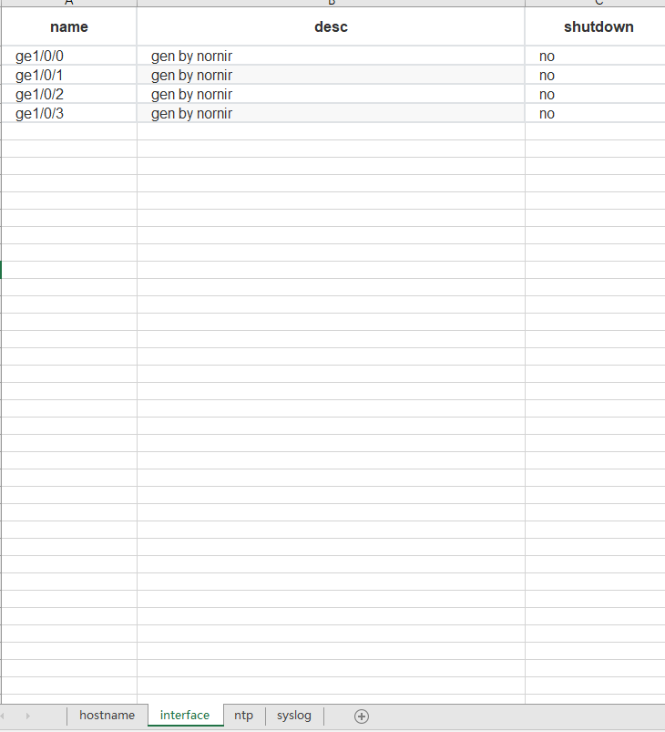

# NetDevOps自动化框架Nornir

一款基于Python开发的，靠基于python代码运行的、灵活、高效、扩展性强的网络专属的配置自动化框架，是当前NetDevOps非常有潜力、不可或缺的工具之一。要讲解它，我们需要先简单了解NetDevOps。

# NetDevOps简介


##  netdevops的产生
### 背景
随着 IT 科技的不断发展，尤其是虚拟化技术和云计算的迅速崛起，网络也从技术、架构到运维都发生了显著的变化，其中非常直观的感受就是：

1. 运维体量的增大
2. 运维管理的细化
3. 运维响应的敏捷化。

这三者的叠加，导致了网络运维遇到了前所未有的困难，网络工程师面对如山的、海量的运维对象和众多的运维需求的同时，技术也不断迭代，在这种困窘之境下还要做到迅速响应。如何破局自救，成为了很多网络运维群体面临的重大课题之一。

### 时间、人物、地点、事件

在这样一个大背景之下，**2014 年**，在**网工圈**刮起了一股 NetDevOps 的风潮，**从个人到组织**，大家在同一个时间段，自下而上地分享如何用 Python 开发、开源的自动化工具提升提高网络运维效能。

愈演愈烈的 NetDevOps 之风从国外吹到了国内，从民间吹到了几大厂商。很多厂商都推出了自己的设备的SDK，比如思科、Juniper、博科等等。有野心的网络设备商也纷纷推出了自己的 **NetDevOps 认证体系**，虽然他们有着不同的名称，比如思科的 **Cisco Certified DevNet Associate**、华为的 **HCIP-Datacom-Network Automation Developer**。

### 我眼中的NetDevOps：

抛开其中的商业部分，他们有着高度相似的内核：希望网络工程师系统地学习以 Python 为核心的开发技术和有益于网络运维的开源组件，能够自己编写自动化脚本，提升自己的运维效能。

**主体**：网络工程师

**技能**：以Python为开发语言，叠加现有的开源工具，分阶段借鉴DevOps的思想

**目标**：提高网络运维效率

## NetDevOps工具链
在NetDevOps逐渐流行的过程中，逐渐演化出了一条针对网络工程师的NetDevOps工具链。


paramiko、netmiko、napalm、textfsm等的流行，促进了网络运维工程师对Python的掌握和使用。


## Nornir的诞生

NetDevOps生态工具的流行也在一定程度上妨碍了网络运维工程师对Ansible的选择，正是大家对于Python过于熟悉，以及这些便利的NetDevOps工具生态，导致大部分网络运维工程师始终在以Python为核心的理念中实践NetDevOps。

而在这个工具链条中，缺失了一个网络配置批量自动化工具，让用户聚焦网络运维业务逻辑及其编排。

而Nornir正是弥补这个工具链中的这一环节。

# Nornir之旅
## Nornir简介

官方的描述：Nornir is an **automation framework written in python** to be **used with python**. Most automation frameworks hide the language they are written in by using some cumbersome pseudo-language（大而笨重的伪代码） which usually is almost Turing complete, but lacks tooling to **debug and troubleshoot**. **Integrating** with other systems is also usually quite hard as they usually have complex APIs if any at all. Some of the other common problems of those pseudo-languages is that are usually quite bad at dealing with data and re-usability is limited.

Nornir aims to solve those problems by providing a pure python framework. Just imagine Nornir as the Flask of automation. Nornir will take care of dealing with the inventory where you have your host information, it will take care of dispatching the tasks to your devices and will provide a common framework to write “plugins”.

一款基于Python开发的，靠基于python代码运行的、灵活、高效、扩展性强的网络专属的配置自动化框架。它对网络设备的纳管是无代理模式的，主要通过SSH对网络设备纳管，实际我们可以编写任意连接管理插件来实现对网络设备的管理。

**Nornir的架构示意图：**


## 与ansible的对比 
虽然它自比flask  但是我们还是习惯地将其与ansible对比。

| **对比项目**       | **nornir**                            | **ansible**                                 |
| ------------------ | ------------------------------------- | ------------------------------------------- |
| 编写               | python                                | 基于yaml的dsl（Domain  Specified Language） |
| 调试               | 给予IDE或者ipdb调试  、logging模块等  | 模块既有的调试输出信息  -vvvv               |
| 效率               | 快                                    | 慢                                          |
| 体量               | 轻便  （5000行代码左右）              | 庞杂                                        |
| 面向对象           | 网络设备                              | 以服务器为主，兼顾网络设备                  |
| 支持的网络设备种类 | 多（得益于netmiko、paramiko、napalm） | 少（以国外设备为主加国内的华为ce系列）      |


运行结果比对：


## 

## Nornir的安装

本教程使用 pip 在win10上安装Nornir

### 环境说明

**操作系统：**

Nornir是一个跨平台的自动化框架，在Linux、Windows、macOS操作系统之下均可正常运行。笔者演示使用的是win10 64位。

**Python版本要求：**

Python 3.7 及以上，笔者推荐使用 Python 3.9。

Windows下安装可以参考https://zhuanlan.zhihu.com/p/523912031

 **纳管节点：**

任意2台以上网络设备（使用网络模拟器即可），系统运维工程师如果想体验，也可以将纳管节点替换为2台以上的Linux虚机。

所有设备需要SSH可达，当前账户需要拥有取消网络设备回显分页的权限（Linux系统可以忽视）。

**IDE：**

Pycharm社区版2022.1

WIndows下安装可以参考https://zhuanlan.zhihu.com/p/523912031

### Nornir的安装

Nornir是一个灵活的自动化框架，只保留了必要的最核心的代码，所有与网络设备进行连接的插件在3.0版本以后均剥离出去。所以我们在安装时，除了安装Nornir，另需要安装一些其他的工具包，这里我们使用pip安装。

```
python -m pip install nornir==3.3.0  nornir_utils nornir_netmiko==0.1.2  netmiko==3.4.0  pandas openpyxl nornir_jinja2
```

其中nornir_table_inventory主要是对接第三方的数据源作为网络设备管理、使用表格管理网络设备时使用，选装，openxyl。

Netmiko笔者推荐使用3.4.0，更加稳定，对应的nornir_netmiko会选择0.1.2版本。

如果Netmiko选择4.0及以上，nornir_netmiko选择最新版本即可。

安装完成后，可以通过如下命令进行校验：

```
python -m pip show nornir  nornir_utils nornir_netmiko  netmiko  pandas openpyxl nornir_jinja2
```

## 第一个Nornir Runbook

### 1 定义inventory

记录众多主机信息，分为主机（hosts）、主机分组（groups）、默认参数（defaults）三块信息，通过是哪个文件进行定义，分别为hosts.yaml、groups.yaml、defaults.yaml。主机在这里主要指的是网络设备。

#### hosts

一台网络设备首先在hosts.yaml中被定义，其相关属性也在hosts.yaml中被定义，所有自定义字段放在data属性中。示例：

示例：hosts.yaml

```yaml
netdevops01:
  hostname: 192.168.137.201
  username: netdevops
  password: Admin123~
  port: 22
  platform: huawei
  data:
    cmds:
      - display version
      - display current-configuration
    series: CE6800
  
netdevops02:
  hostname: 192.168.137.202
  username: netdevops
  password: Admin123~
  port: 22
  platform: huawei
  data:
    cmds:
      - display version
      - display current-configuration
    series: CE6800
```

如上是一个hosts.yaml的示例，其中netdevops01与netdevops02代表两台网络设备，是网络设备的name，全局必须唯一。

#### groups

一个网络设备可以属于多个分组，网络设备会自动继承分组的所有信息。

示例：groups.yaml

```yaml
---
huawei:
  platform: huawei
  username: netdevops
  password: Admin123~
  port: 22
  connection_options:
    netmiko:
      extras:
         timeout: 120
         conn_timeout: 20
  data:
    backup_cmds:
      - display version
      - display current-configuration

beijing:
  data:
    city: beijing
```

可以将hosts.yaml中的host添加groups属性，其值为数组，即一个网络设备可以属于多个分组。host会继承groups中的所有属性，如果有冲突host的优先级大于group的优先级，group中有冲突，排序靠前的优先级大。实际操作中，建议分组尽量不要有字段冲突，从不同维度去描述分组。

hosts.yaml修改为如下，增加groups属性，添加groups.yaml中定义的分组。

示例：hosts.yaml

```yaml
---
netdevops01:
  hostname: 192.168.137.201
  groups:
    - huawei
    - beijing

netdevops02:
  hostname: 192.168.137.202
  groups:
    - huawei
    - beijing
```

#### defaults

全局默认变量，对于host全局统一的默认变量可以定义在defaults文件中。所有host均继承defaults中定义的字段，但是如有冲突，defaults中定义的字段优先级最低。

示例： defaults.yaml

```yaml
---
username: netdevops
port: 22
data:
  desc: just a demo
```


以上三个文件hosts.yaml是必须定义的，其他文件是按需定义的。定义好之后，一般将这三个文件放到inventory文件夹内。

### 2 初始化Nornir对象

当我们编辑好inventory文件之后，我们就可以通过配置文件加载一个nornir对象，然后筛选网络设备，对指定的网络设备进行批量操作（执行task函数）。

参考：https://nornir.readthedocs.io/en/latest/configuration/index.html

#### 2.1 定义配置文件

配置文件用于告知Nornir框架，我们想创造一个什么样的Nornir对象：加载inventory、执行器、日志配置等。

参考：https://nornir.readthedocs.io/en/latest/configuration/index.html#configuration

工程目录下创建一个config.yaml文件（可以实际情况修改此配置文件名称），内容示例：

```yaml
---
inventory:
  plugin: SimpleInventory
  options:
    host_file: "inventory/hosts.yaml"
    group_file: "inventory/groups.yaml"
    defaults_file: "inventory/defaults.yaml"

runner:
  plugin: threaded
  options:
    num_workers: 50

logging:
  enabled: True
  level: INFO
  log_file: nornir.log
 
```

#### 2.2 创建Nornir对象

Nornir对象是对一组网络设备的执行批量操作task的一个对象，同时会记录执行结果。

我们创建一个batch_backup.py的Python文件，代码内容如下：

```python
from nornir import InitNornir
from nornir_utils.plugins.functions import print_result
from nornir_netmiko import netmiko_send_command

if __name__ == '__main__':
    nr = InitNornir(config_file="nornir.yaml")
    print(nr)
```


#### 2.2 筛选网络设备

我们可以通过Nornir提供的灵活筛选的函数，对Nornir对象调用筛选方法，灵活筛选网络设备。

**基本筛选**

```python
from nornir import InitNornir

if __name__ == '__main__':
    nr = InitNornir(config_file="nornir.yaml")
	huawei_devs = nr.filter(platform='huawei') # 直接按字段进行筛选，可同时筛选多个字段，这些字段之间是且的关系
	print(huawei_devs.inventory.hosts)
```

**自定义筛选函数**

```python
from nornir import InitNornir

# 定义筛选函数
def huawei_bj_filter(host):
    if host.platform == 'huawei' and host['city'] == 'beijing':
        return True
    return False
    
    
if __name__ == '__main__':
	nr = InitNornir(config_file="nornir.yaml")
    # 调用筛选函数，赋值filter_func为我们定义的筛选函数即可
	huawei_beijing_devs = nr.filter(filter_func=huawei_bj_filter)
    print(huawei_beijing_devs.inventory.hosts)
```

**过滤对象逻辑运算筛选**

```python
from nornir import InitNornir
from nornir.core.filter import F

nr = InitNornir(config_file="nornir.yaml")
# 逻辑非运算，使用~
nr_devs = nr.filter(~F(city='shanghai'))
# 逻辑且运算，使用&
nr_devs = nr.filter(F(platform='huawei')&F(city='beijing'))
# 逻辑或运算，使用|
nr_devs = nr.filter(F(city='beijing')&F(city='shanghai'))
```

### 3 对指定网络设备执行task

#### 3.1 定义task函数

task是一个可以对单台网络设备反复使用的符合Nornir规范的函数，类似ansible中的module。

定义规则：

1. 函数的定义方式，可以有多个参数，也可以无参数。
2. 第一个参数代表一台网络设备执行情况的上下文，官网约定俗称为task，笔者建议使用task_context，防止与task函数混淆。
3. 返回结果为 nornir.core.task.Result 对象。

```python
from nornir import InitNornir
from nornir.core.task import Result
from nornir_utils.plugins.functions import print_result


def say_hello(task_context):
    """
    让每台设备来和大家打个招呼
    :param task_context:用于上下文相关信息的管理，比如设备信息，nornir的配置等等
    :return:返回打招呼的字符串
    """
    words_templ = "Hello!I'm a network device. My name is{}"
    words = words_templ.format(task_context.host.name)
    return Result(host=task_context.host, result=words)

if __name__ == '__main__':

    nr = InitNornir(config_file="nornir.yaml")
    results = nr.run(task=say_hello)
    print_result(results)
```


#### 3.2 执行runbook

我们只需调用Nornir对象的run方法，赋值要执行的任务函数（对应task参数）即可，如果要给task函数的参数赋值，在run方法中一一赋值即可。

 #### 3.3 结果输出

执行结果的打印使用的是print_result，打印的格式也与ansible非常相似。但是有一点，当我们看到打印结果的时候，实际上指定任务已经执行结束。


如果想实时打印结果，需要在task函数中打印，会有代码侵入。


#### 3.4 处理器

处理器类似回调函数，可以在任务开始、结束、子任务执行、结果等环节，通过Python代码插入我们任意想执行的内容，比如推送给某数据平台、告警平台、cmdb等等。Nornir是一个非常灵活的框架，需要我们挖掘它的潜力，甚至很多场景，作者也不一定会想到它的妙用。

参考：https://www.gingerdoc.com/nornir-%E5%A4%84%E7%90%86%E5%99%A8

```python
from nornir import InitNornir
from nornir.core.inventory import Host
from nornir.core.task import AggregatedResult, MultiResult, Result, Task


class RealTimePrintResult:
    def task_started(self, task: Task) -> None:
        print(f">>> starting: {task.name}")

    def task_completed(self, task: Task, result: AggregatedResult) -> None:
        print(f">>> completed: {task.name}")

    def task_instance_started(self, task: Task, host: Host) -> None:
        pass

    def task_instance_completed(
        self, task: Task, host: Host, result: MultiResult
    ) -> None:
        print(f"  - {host.name}: - {result.result}")

    def subtask_instance_started(self, task: Task, host: Host) -> None:
        pass  # to keep example short and sweet we ignore subtasks

    def subtask_instance_completed(
        self, task: Task, host: Host, result: MultiResult
    ) -> None:
        pass  # to keep example short and sweet we ignore subtasks

def say_hello(task_context):
    """
    让每台设备来和大家打个招呼
    :param task_context:用于上下文相关信息的管理，比如设备信息，nornir的配置等等
    :return:返回打招呼的字符串
    """
    words_templ = "Hello!I'm a network device. My name is {}"
    words = words_templ.format(task_context.host.name)
    return Result(host=task_context.host, result=words)

if __name__ == '__main__':

    nr = InitNornir(config_file="nornir.yaml")
    nr_with_processors = nr.with_processors(processors=[RealTimePrintResult()])
    results = nr_with_processors.run(task=say_hello)
```


#### 3.5 grouping task

task函数之间可以相互组合调用，实现代码的复用。

只需要对task函数中的task上下文（即task_context变量）调用run方法，调用方式与Nornir对象的调用完全一致。

```python
from nornir import InitNornir
from nornir.core.task import Result
from nornir_utils.plugins.functions import print_result


def say_with_words(task_context, words):
    words_templ = "{}"
    words = words_templ.format(words)
    return Result(host=task_context.host, result=words)


def say_dev_name(task_context):
    words_templ = "This is {}."
    words = words_templ.format(task_context.host)
    return Result(host=task_context.host, result=words)


def grouping_say(task_context):
    task_context.run(task=say_with_words, words='Hello!',name='Say Hello')
    task_context.run(task=say_dev_name,name='Say Name')
    task_context.run(task=say_with_words, words='Bye!',name='Say Bye')
    result = 'Grouing task is done'
    return Result(host=task_context.host, result=result)


nr = InitNornir(config_file="nornir.yaml")
results = nr.run(task=grouping_say)
print_result(results)

```


#### 3.5 Nornir的结果对象

Nornir执行结果分为四个维度，自下而上分别是：真实执行结果、单台设备的单次任务的执行结果对象（Result）、单台设备的所有任务的执行结果对象列表、所有设备的所有任务的执行结果，可以参考如下代码。这些结果可以让我们更灵活地将代码与其他框架结合，对结果进行判断。

```python
from nornir import InitNornir
from nornir.core.task import Result


def get_dev_platform(task_context):
    return Result(host=task_context.host, result=task_context.host.platform)


def get_dev_info(task_context):
    dev_info = {
        'name': task_context.host.name,
        'ip': task_context.host.hostname,
    }
    # task上下文调用run方法，执行结果返回的是当前设备调用的task函数的所有结果即MultiResult对象
    host_task_result_obj = task_context.run(get_dev_platform)
    # 由于task函数可以组合调用，最顶层调用位于MultiResult对象最前列
    # 我们用类似列表的索引方式，访问索引0即可获取我们调用的task函数的执行结果
    # 然后取其result属性获取实际返回的载荷结果，
    # 也可以访问其failed等属性，了解其是否失败或者此次任务是否对设备配置产生影响
    platform = host_task_result_obj[0].result
    dev_info['platform'] = platform
    return Result(host=task_context.host, result=dev_info)


if __name__ == '__main__':

    nr = InitNornir(config_file="nornir.yaml")
    nr_results = nr.run(task=get_dev_info)
    print(nr_results, type(nr_results))

    # AggregatedResult对象类似字典，我们可以通过调用其items方法对其循环，
    # 返回的结果是一个元组，两个值对应Host对象和当前Host对象的所有task任务执行结果MultiResult对象
    for host, host_results in nr_results.items():
        print('#' * 20, '这是一个设备的所有task的执行结果MultiResult对象', '#' * 20)
        print(host_results)
        print(type(host_results))
        print('-' * 20, '接下来我们循环迭代一个设备所有task任务的执行结果', '-' * 20)
        # MultiResult对象类似列表，我们直接可以进行for循环，可以使用索引号访问其某次task执行的结果Result对象
        for host_task_result_obj in host_results:
            print('~' * 20, '这是一台设备一个task任务的执行结果Result对象', '~' * 20)
            print(type(host_task_result_obj))
            print(host_task_result_obj)
            print('+' * 20, '这是一台设备一个task任务的执行结果Result对象的result属性', '+' * 20)
            print(type(host_task_result_obj.result))
            print(host_task_result_obj.result)
```

执行失败的设备也可以在Nornir对象执行完成后，其结果对象（上述代码中的nr_results变量）中会有failed_hosts，内含失败的网络设备。

这种复杂的对象，可以非常好地通过内嵌到Python代码中，与其他框架进行结合。

# coding Time

### 网络配置备份

#### 1 登录设备执行命令

调用nornir_netmiko的netmiko_send_command task函数，发送命令。其参数说明可以通过Pycharm等IDE下钻到对应文件查看。

```python
from nornir import InitNornir
from nornir_netmiko import netmiko_send_command
from nornir_utils.plugins.functions import print_result

if __name__ == '__main__':
    nr = InitNornir(config_file="nornir.yaml")
    results = nr.run(task=netmiko_send_command, command_string='display current-configuration')
    print_result(results)

```

#### 2 设备回显写入文件

我们可以自己编写写入文件的task函数，然后组合调用发送命令和写文件的task函数即可。

```python
from datetime import date

from nornir import InitNornir
from nornir.core.task import Result
from nornir_netmiko import netmiko_send_command
from nornir_utils.plugins.functions import print_result
from nornir_utils.plugins.tasks.files import write_file


def config_backup(task_context):
    cmds = task_context.host.data['cmds']
    cmds = cmds.split(',')
    date_str = date.today().strftime('%Y%m%d')
    ip = task_context.host.hostname
    for cmd in cmds:
        cmd_multi_result_objs = task_context.run(task=netmiko_send_command, command_string=cmd)
        output = cmd_multi_result_objs[0].result
        filepath = '{}_{}_{}.txt'.format(date_str, ip, cmd)
        file_multi_result_objs = task_context.run(task=write_file,
                                                  filename=filepath,
                                                  content=output)

    return Result(host=task_context.host, result=cmds)


if __name__ == '__main__':
    nr = InitNornir(config_file="nornir.yaml")
    results = nr.run(task=config_backup)
    print_result(results)
```


### 批量配置生成


nornir_jinja2中还集成了jinja2的相关功能，可以实现配置标准化。

我们可以通过表格或者yaml文件来进行配置项的参数化，使用jinja2来完成模板的标准化。

在此我们暂时选择Excel，原因有二：1. 网络工程师的接受程度 2.网络配置项的批量化特性

表格参考j2_data中的以设备hostname命名的Excel文件，此处使用pandas进行了读取，处理成了字典。



通过这段代码我们可以将Excel中的数据加载成字典：

```
def get_complex_data_from_excel(file='data.xlsx'):
    # 通过表格获取数据，参考jinja2篇章代码
    data = {}
    df_dict = pd.read_excel(file, sheet_name=None)
    for i in df_dict:
        data[i] = df_dict[i].to_dict(orient='records')
    return data
```

模板参考j2_templates中的jinja2模板——interface_config.j2。

```jinja2

interface {{ intf['name'] }}
 description {{ intf.desc }}

shutdown

undo shutdown

请人工确认端口状态配置


commit
```

编写task函数gen_config_by_j2，读取数据，渲染模板，写入到指定文件夹。

```
from pathlib import Path

import pandas as pd
from nornir import InitNornir
from nornir.core.task import Result
from nornir_jinja2.plugins.tasks import template_file
from nornir_utils.plugins.functions import print_result
from nornir_utils.plugins.tasks.files import write_file


def get_complex_data_from_excel(file='data.xlsx'):
    # 通过表格获取数据，参考jinja2篇章代码
    data = {}
    df_dict = pd.read_excel(file, sheet_name=None)
    for i in df_dict:
        data[i] = df_dict[i].to_dict(orient='records')
    return data


def gen_config_by_j2(task_context,
                     j2_template,
                     j2_data_dir='j2_data',
                     j2_template_dir='j2_template',
                     configs_dir='configs'):
    """
    通过表格文件和Jinja2模板渲染生成标准化配置
    Args:
        j2_template: 调用的jinja2模板
        j2_data_dir: 承载数据的表格文件所放目录
        j2_template_dir: jinja2模板所存放的目录
        configs_dir: 渲染生成的模板放置的目录


    Returns:渲染生成的配置的路径
    """
    # 拼接数据表格文件路径
    data_file = '{}.xlsx'.format(task_context.host.hostname)
    data_file = str(Path(j2_data_dir, data_file))
    # 获取表格中的数据
    data = get_complex_data_from_excel(data_file)

    # 通过nornir_jinja2渲染生成配置
    multi_result = task_context.run(task=template_file,
                                    template=j2_template,
                                    path=j2_template_dir,
                                    data=data)
    config_str = multi_result[0].result

    # 根据IP生成配置文件的名称
    file_name = '{}.txt'.format(task_context.host.hostname)
    file_name = str(Path(configs_dir, file_name))
    # 使用nornir_utils的write_file将配置写入文件
    task_context.run(write_file, filename=file_name, content=config_str)

    return Result(host=task_context.host, result=file_name)


if __name__ == '__main__':
    nr = InitNornir(config_file="nornir.yaml")
    result = nr.run(task=gen_config_by_j2, j2_template='interface_config.j2')
    print_result(result)

```


### 批量配置推送

一些无交互的网络配置，且每台网络设备的配置完全一致，我们通过nornir_netmiko，可以进行批量配置推送。

简单demo：

```python
from nornir import InitNornir
from nornir_netmiko import netmiko_send_config
from nornir_utils.plugins.functions import print_result

if __name__ == '__main__':
    nr = InitNornir(config_file="nornir.yaml")
    dev01 = nr.filter(name='netdevops01')
    result = dev01.run(task=netmiko_send_config,
                       config_file=f'configs/192.168.137.201.txt',
                       name='推送配置到网络设备')
    print_result(result)

```

但不同设备的配置可能不同，我们在configs文件夹中，以设备的hostname为前缀去使用对应的配置。这些配置如果是jinja2生成的，风险会低于手工编写的配置。

不同网络设备，其交互方式可能会有差异，此处我们未使用nornir_netmiko的netmiko_send_config，而是使用了其提供的netmiko连接，调用netmiko本身的方法，对不同网络设备使用不同的交互。

```python
from pathlib import Path

from nornir import InitNornir
from nornir.core.task import Result
from nornir_utils.plugins.functions import print_result
from nornir_netmiko import netmiko_send_config


def push_configs(task_context, config_dir='configs'):
    """
    从指定文件夹内读取设备IP.txt的配置文件，推送给网络设备
    Args:
        config_dir: 配置文件的目录

    Returns:
        配置过程的回显

    """
    output = ''
    # 拼接配置文件路径，任何对象在format函数中使用的时候都会强制用str转为字符串
    config_file = '{}.txt'.format(Path(config_dir, task_context.host.hostname))
    # 获取netmiko连接
    net_conn = task_context.host.get_connection('netmiko', task_context.nornir.config)
    # 判断是否enable
    if net_conn.secret:
        net_conn.enabled()
    # 通过配置文件推送配置
    output = output + net_conn.send_config_from_file(config_file=config_file)
    # 保存配置
    output = output + net_conn.save_config()
    # 回显结果放入结果中，变更成功，配置发生了变化。
    return Result(host=task_context.host, result=output, changed=True)


if __name__ == '__main__':
    nr = InitNornir(config_file="nornir.yaml")
    result = nr.run(task=push_configs,
                    config_dir='configs',
                    name='推送配置到网络设备')
    print_result(result)

```


## 总结

希望这次分享达到的目标：

1. 了解NetDevOps
2. Nornir的安装
3. Nornir的基本概念及简单runbook的编写
4. 逐步掌握编写自己的Nornir Runbook

