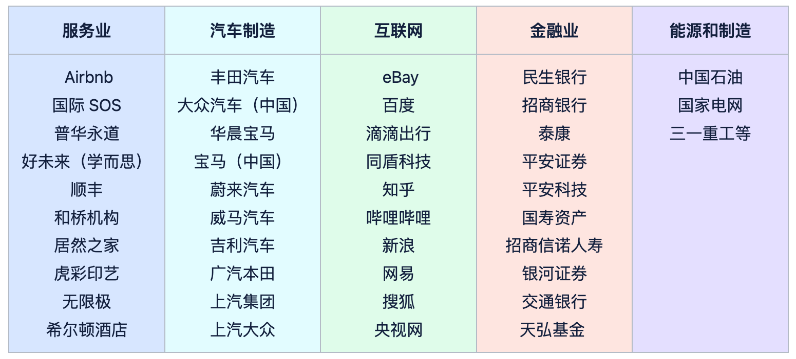
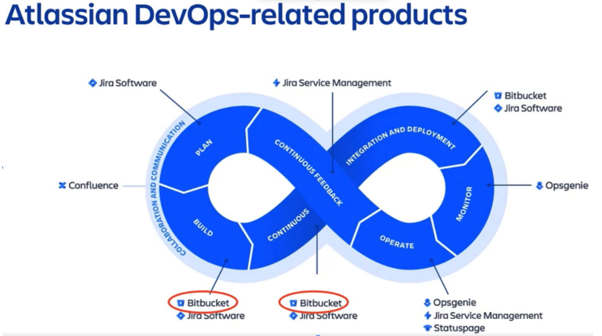
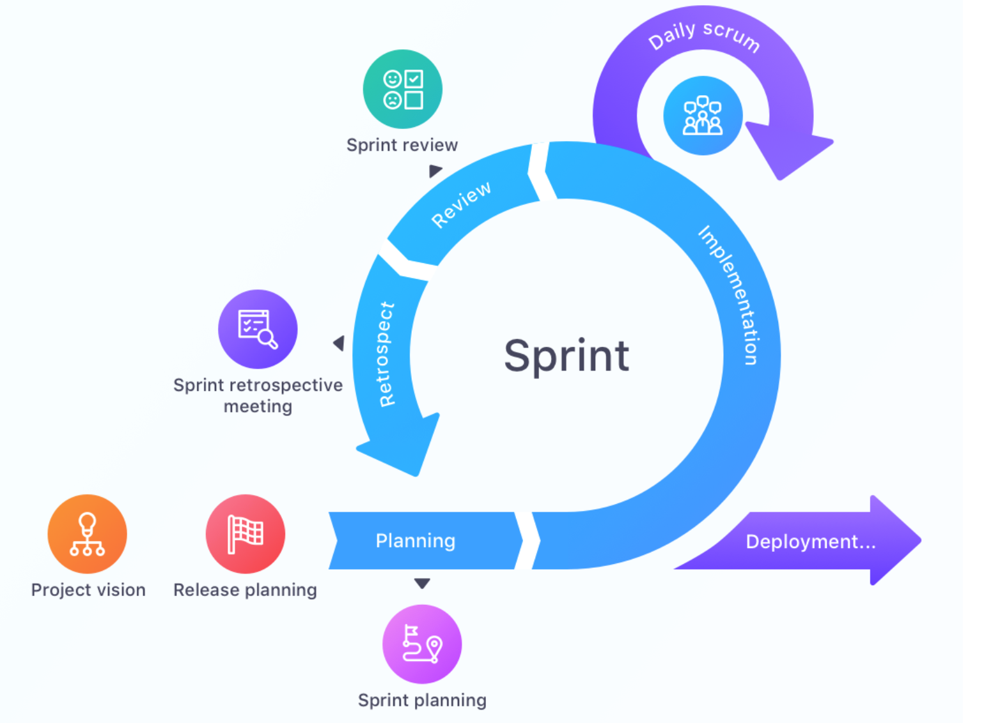
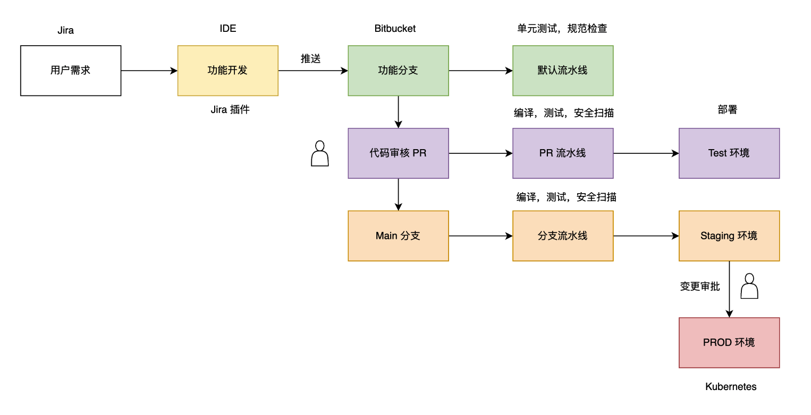
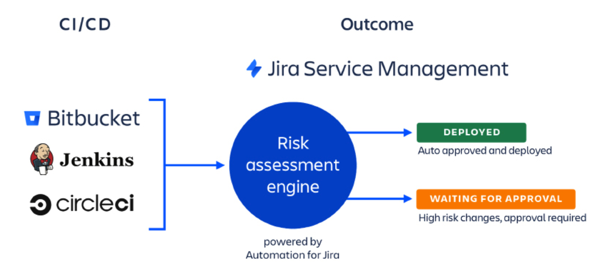

# DevOps 工具鉴宝之 Atlassian Jira

从 DevOps 角度，体验 Atlassian 全家桶核心用户场景和产品功能，了解大型企业的需求管理和研发工具链落地实施。

## 产品介绍 (5 min)

Atlassian Corporation Plc 成立于 2002 年，旨在帮助软件团队更好地合作。该公司的产品可帮助团队组织，讨论和完成他们的工作，从而为组织带来卓越的成果。该公司的主要产品包括针对软件团队的 Jira Software 和针对其他业务团队的 Jira Work Management，用于内容创建和共享的 Confluence，用于捕获并快速添加结构的 Trello。团队的形成工作，团队服务和支持应用程序的 Jira Service Management，事件管理的 Opsgenie，企业敏捷计划的 Jira Align，用于代码共享和管理的 Bitbucket，以及用于企业级安全和集中管理的 Atlassian Access。**公司的产品在一起构成了一个用于组织，讨论和完成共享工作的集成系统，从而深深地扎根于人们如何协作以及组织如何运作**。21 年底，Atlassian Marketplace 累计销售额超过 **20 亿 美元**，拥有 **5,300+** 应用程序。

- user case

## 产品选择和配置管理 (10 min - yy)

- plan 如何规划
- process 如何实施
- result 效果展示（后续演示）

## 全流程交付场景演示 (40 min)

### 需求管理 - requirement management (yy)

- 产品路线规划 product roadmap (set fix version)
- 产品文档管理 PRD in confluence => user story => backlog
- 敏捷研发模式选择 scrum board /kanban
- 站会跟进 active sprint (Kanban - WIP，开发流程后续演示)
- 拉取分支时，自动更新 Jira Story 卡片到 In Progress 状态
- PR Merged 时，自动更新 Jira Story 卡片到 Resolved 状态
- 冲刺结束 close sprint (后续演示)
- 冲刺回顾 retrospective （后续演示）

### 研发集成 development integration (toby)

- 选择需求 select user story as example
- 创建分支 create feature branch
- 本地开发 IDE integration with Jira and Bitbucket
- VSCode 前端
- Intellij IDEA 后端
- SourceTree 官方客户端
- 提交规范 commit convention
- 代码审核 code push & code review in bitbucket (jira in progress)
- 流水线自动化 Bitbucket pipeline (provided by atlassian)
- build
- test
- scan
- publish
- deploy
- 审核注释和任务跟进 fix review comment and push again, resolve review tasks
- 合并到主分支 merge to main branch (jira revolved)
- 部署到 Staging 环境 CD triggered in main branch, go to staging environment
- 回归测试 start regression testing in staging (mention testing plugin)
- 生产环境变更审核 pause prod deployment & gating
- 变更管理和自动化流程 release management => change ticket
- 生产环境部署 validate ticket and go production, create tag in Bitbucket
- 自动完成需求卡片 close jira

### 部署管理 deployment management (toby)

- 在 CD 中，到 Production 部署时，会自动创建线上变更申请单；
- CD 关联的代码仓库对应的服务变更的 Approvers 收到审批提醒 (邮件，站内信）
- Service Approvers 审批通过
- JSM Change workflow 变更过程自动化
- CD 生产环境部署继续
- CD 生成环境部署完成（成功），Jira Story 卡片自动更新到 Done 状态

### 敏捷迭代 sprint closing (toby)

- 查看需求所关联研发流程数据 Review Jira detail
  - 自动状态流转 Status change to done
  - 开发分支和提交记录 Development panel
  - 自动化历史记录 Automation history
  - 发布上线记录 Review deployment status and deployment environment
- 关闭一个冲刺迭代 Closing sprint
- 创建回顾会议记录 Create retrospective
- 查看敏捷迭代报告 Review Jira reports
